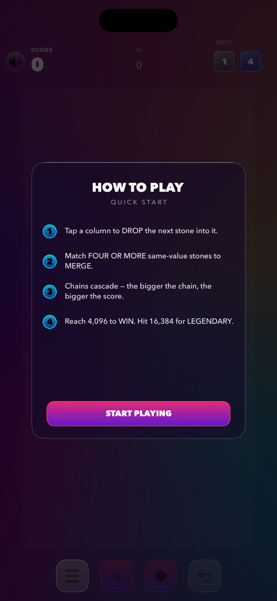
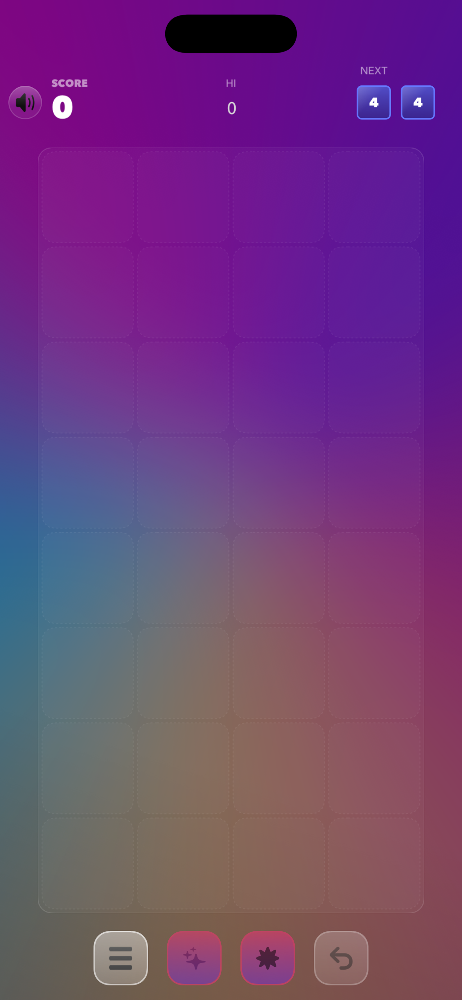
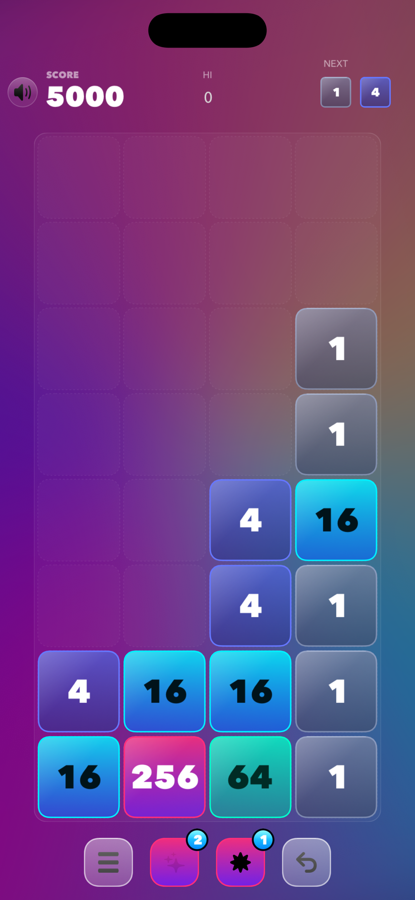
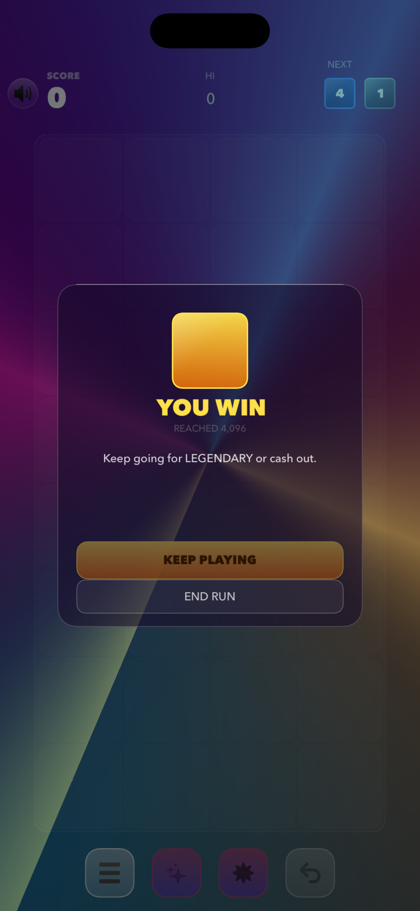

# Quadcade

**Drop. Match four. Chain a cascade.**
A neon-glass merge puzzle built for short, intense sessions and the one-more-run feeling.

  
  
  
  

## How it plays

Stones drop into a four-column grid. Match **four** of a kind and they merge up the tier ladder — 4 → 16 → 64 → 256 → 1024 → **4,096 (WIN)** → **16,384 (LEGENDARY)**. Chain cascades for exponential payoffs and stack a combo multiplier up to ×3 by keeping your streak alive. Miss a merge and the combo shatters.

## The fun is in the choices

- **Wildstone** — arm it, and the board tells you where it fits. Closes a cluster of any tier.
- **Bomb** — tap to arm, tap the stone blocking your setup. The column above falls into the gap.
- **Near-merge hints** — cells flash in the tier's color the moment you set up a 3-cluster, so you can see your next finish.
- **Named feats** — DOUBLE, TRIPLE, QUAD, CHAIN-3, CHAIN-5+, PERFECT CLEAR. Score bursts and bomb grants in the moment.

## Progression that gives back

- **256 CLUB** and **1024 CLUB** flashes celebrate the climb and drop a bomb in your hand.
- Every 1024 you make grants another bomb. Hoard them for the clutch move.
- Your bomb cap grows with your scores: **2** to start, **3** after WIN, **4** after LEGENDARY.

## Neon-glass polish

- Retrofuturist synthwave palette. Glass tile lighting. Conic aurora backdrop.
- Full accessibility: colorblind mode (tier shapes), Reduce Motion, VoiceOver labels.
- Tuned haptics and sound. No ads. No nags.

> Reach 4,096 for the WIN. Reach 16,384 for LEGENDARY.
> *And some things aren't documented.*

## Links

- [Privacy Policy](privacy/)
- [Support & FAQ](support/)
